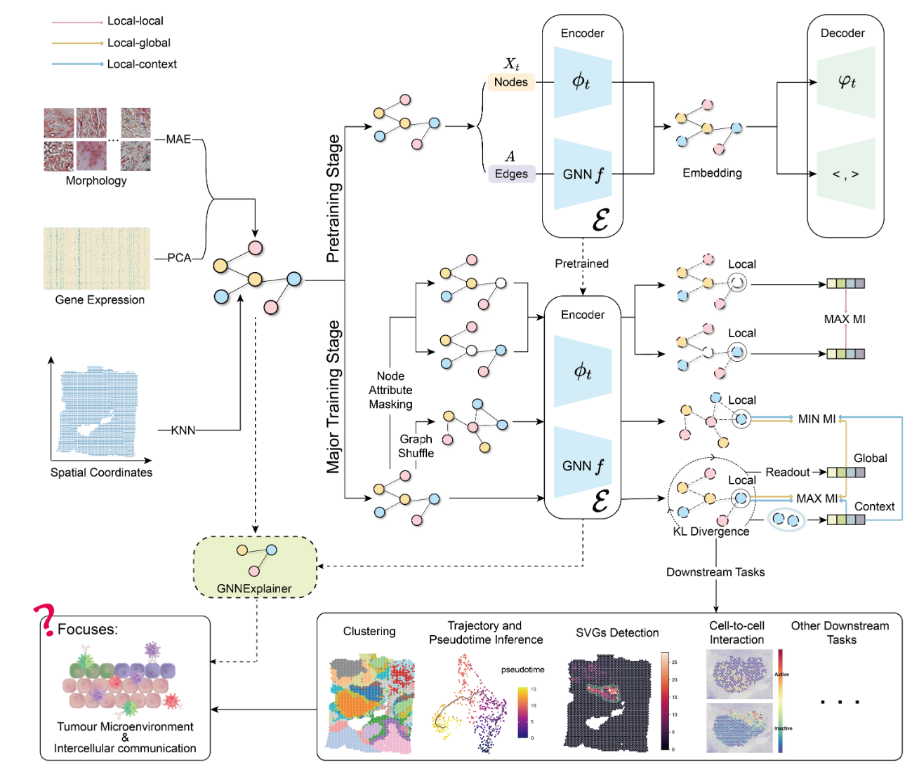

# [conST: an interpretable multi-modal contrastive learning framework for spatial transcriptomics](https://www.biorxiv.org/content/10.1101/2022.01.14.476408v1)
We are actively updating this repository! More features/examples/experiments coming soon!

## Overview


Framework of conST. conST models the ST data as a graph by treating gene expression and
morphology as node attributes and constructing edges by spatial coordinates. The training is divided into
two stages: pretraining and major training stage. Pretraining stage initializes the weights of the encoder E
by reconstruction loss. In major training stage, data augmentation is applied and then contrastive learning
in three levels, i.e., local-local, local-global, local-context, are used to learn a low-dimensional embedding by
minimize or maximize the mutual information (MI) between different embeddings. The learned embedding
can be used for various downstream tasks, which, when analyzed together, can shed light on the widely
concerned tumour microenvironment and cell-to-cell interaction. GNNExplainer helps to provide more con-
vincing predictions with interpretability.

## Dependencies
- Python=3.7.11
- torch=1.8.0
- torchvision=0.9.2
- torch-geometric=2.0.1
- torch-scatter=2.0.8
- torch-sparse=0.6.12
- scikit-learn=0.24.2
- umap-learn=0.5.1
- scanpy=1.8.1
- seaborn=0.11.2
- scipy=1.7.1
- networkx=2.6.3
- pandas=1.3.3
- anndata=0.7.6
- timm=0.4.12
- leidenalg=0.8.7


## Usage
Run `conST_cluster.ipynb` for a clustering demo of slice 151673 of [spatialLIBD](http://spatial.libd.org/) dataset.
You can change the argparser in the notebook to explore different modes. We also release the trained weights `conST_151673.pth`.

Demo uses [spatialLIBD](http://spatial.libd.org/) dataset. We have organized the file structure and put the data in [Google Drive](https://drive.google.com/file/d/1a3dFS0V7Y6QNA5wVxEcqau9CtntAjZQc/view?usp=sharing). Please download and put it into `data` folder.
If you want to experiment with other data, you can arrange the file structure the same as it.

Instructions for using MAE to extract morphology features can be found [here](MAE-pytorch/README.md).

<!---
### Note
Due to the CUDA non-deterministic characteristic of the sparse tensor operations in [Pytorch Geometrics](https://pytorch.org/docs/stable/generated/torch.use_deterministic_algorithms.html), performance may vary with different runs or in different hardware devices. 
To achieve the best performance, you may want to run code for multiple times or slightly adjust the parameters.
To ensure the reproducibility, we will release the trained weights that we use in the paper. 
Also, we plan to upgrade the code in the future to avoid this problem.
-->

## Cite
If you find this code useful, please consider citing
```html
@article {Zong2022.01.14.476408,
	author = {Zong, Yongshuo and Yu, Tingyang and Wang, Xuesong and Wang, Yixuan and Hu, Zhihang and Li, Yu},
	title = {conST: an interpretable multi-modal contrastive learning framework for spatial transcriptomics},
	elocation-id = {2022.01.14.476408},
	year = {2022},
	doi = {10.1101/2022.01.14.476408},
	publisher = {Cold Spring Harbor Laboratory},
	URL = {https://www.biorxiv.org/content/early/2022/01/17/2022.01.14.476408},
	journal = {bioRxiv}
}
```


## Acknowledgement
The code is partly adapted from [SEDR](https://github.com/JinmiaoChenLab/SEDR), [GIC](https://github.com/cmavro/Graph-InfoClust-GIC), [SpaGCN](https://github.com/jianhuupenn/SpaGCN).
